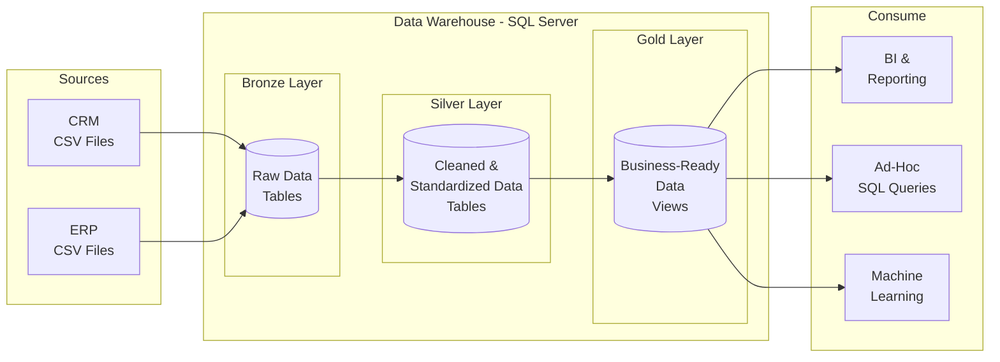

# SQL Data Warehouse

A medallion architecture data warehouse built with SQL Server, featuring Bronze, Silver, and Gold layers for progressive data cleansing and transformation.

## Overview

This project implements a modern data warehouse using the **medallion architecture** pattern (Bronze → Silver → Gold). It ingests raw CRM and ERP data from CSV files, cleans and standardizes it through defined transformation layers, and delivers business-ready dimension and fact views for analytics and reporting.

The warehouse follows industry best practices including surrogate key generation, slowly changing dimension patterns, star schema modeling, and automated data quality testing.

## Key Features

- **Medallion Architecture** — Three-tiered data pipeline with clear separation of concerns
- **Automated ETL** — Stored procedures for batch loading with full refresh capability
- **Data Quality Tests** — Automated validation checks for silver and gold layers
- **Star Schema Modeling** — Dimension and fact views optimized for analytical queries
- **Surrogate Keys** — Generated for dimension tables to support efficient joins and indexing
- **Data Integration** — Combines CRM and ERP sources into unified business views

## Tech Stack

| Component | Technology |
|-----------|-----------|
| Database | SQL Server |
| ETL | T-SQL Stored Procedures |
| Data Quality | SQL-based validation tests |
| Modeling | Star Schema (Dimensions + Facts) |
| Sources | CSV files (CRM, ERP) |

## SQL Data Warehouse Architecture



### Layer Details

| | Bronze Layer | Silver Layer | Gold Layer |
|--|-------------|-------------|-----------|
| **Object Type** | Tables | Tables | Views |
| **Load** | Batch Processing, Full Load, Truncate & Insert | Batch Processing, Full Load, Truncate & Insert | No Load |
| **Transformations** | None (as-is) | Data Cleansing, Standardization, Normalization, Derived Columns, Data Enrichment | Data Integrations, Aggregations, Business Logics |
| **Data Model** | None (as-is) | None (as-is) | Star Schema, Flat Table, Aggregated Table |

### Bronze Layer

The landing zone for raw data. CSV files from CRM and ERP sources are ingested into SQL Server tables with no transformations. This preserves the original data as-is for auditability and reprocessing.

**Tables:** `crm_cust_info`, `crm_prd_info`, `crm_sales_details`, `erp_loc_a101`, `erp_cust_az12`, `erp_px_cat_g1v2`

### Silver Layer

The cleaning and standardization layer. Bronze data undergoes deduplication, null handling, code normalization, date conversion, and derived column calculations. This layer produces a single version of truth ready for integration.

**Key Transformations:**
- Deduplication using `ROW_NUMBER()` to retain most recent records
- Code-to-value normalization (e.g., `S` → `Single`, `DE` → `Germany`)
- Date integer-to-DATE conversion with invalid date handling
- Sales amount recalculation for data consistency
- Audit column (`dwh_create_date`) added to all tables

**Tables:** `crm_cust_info`, `crm_prd_info`, `crm_sales_details`, `erp_loc_a101`, `erp_cust_az12`, `erp_px_cat_g1v2`

### Gold Layer

The business-ready layer. Silver data is integrated across sources and modeled into a star schema with dimension and fact views. No physical load is required — views query silver data at runtime.

**Views:**
- `dim_customers` — Customer dimension with demographics, location, and gender resolution across CRM/ERP sources
- `dim_products` — Product dimension with category details, filtered to active products only
- `fact_sales` — Sales transactions linked to dimensions via surrogate keys

## Data Schema

### CRM Tables

```
crm_cust_info                    crm_prd_info
┌──────────────┐                 ┌──────────────┐
│ cst_id   PK  │                 │ prd_id   PK  │
│ cst_key      │                 │ cat_id       │
│ ...          │                 │ prd_key      │
└──────┬───────┘                 │ ...          │
       │                         └──────┬───────┘
       │                                │
       ▼                                ▼
┌──────────────────────────────────────────────┐
│              crm_sales_details               │
├──────────────────────────────────────────────┤
│ sls_ord_num  PK    sls_prd_key  FK ◄─────────┤── prd_key
│ sls_cust_id  FK ◄────────────────────────────┤── cst_id
│ sls_order_dt        sls_ship_dt              │
│ sls_due_dt          sls_sales                │
│ sls_quantity        sls_price                │
└──────────────────────────────────────────────┘
```

### ERP Tables

```
crm_cust_info                    crm_prd_info
┌──────────────┐                 ┌──────────────┐
│ cst_key      │                 │ cat_id       │
└──────┬───────┘                 └──────┬───────┘
       │                                │
       ▼                                ▼
┌────────────────┐  ┌────────────────┐  ┌────────────────┐
│ erp_cust_az12  │  │ erp_loc_a101   │  │erp_px_cat_g1v2 │
├────────────────┤  ├────────────────┤  ├────────────────┤
│ cid  FK ◄──────┤  │ cid  FK ◄──────┤  │ id   PK ◄──────┤
│ bdate          │  │ cntry          │  │ cat            │
│ gen            │  └────────────────┘  │ subcat         │
└────────────────┘                      │ maintenance    │
                                        └────────────────┘
```

## Project Structure

```
sql_data_warehouse/
├── data/
│   ├── source_crm/          # CRM source CSV files
│   │   ├── cust_info.csv
│   │   ├── prd_info.csv
│   │   └── sales_details.csv
│   └── source_erp/          # ERP source CSV files
│       ├── cust_az12.csv
│       ├── loc_a101.csv
│       └── px_cat_g1v2.csv
├── src/
│   ├── bronze/
│   │   ├── create_schema.sql
│   │   ├── create_ddl.sql
│   │   └── load_data.sql
│   ├── silver/
│   │   ├── silver_ddl.sql
│   │   └── silver_data_cleaning.sql
│   └── gold/
│       └── gold_views.sql
├── test/
│   ├── silver_test.sql
│   └── gold_test.sql
├── LICENSE
└── README.md
```

## Quick Start

```sql
-- 1. Create schemas and bronze tables, then load
-- Run: src/bronze/create_schema.sql
-- Run: src/bronze/create_ddl.sql
EXEC bronze.load_bronze;

-- 2. Create silver tables and transform
-- Run: src/silver/silver_ddl.sql
EXEC silver.load_silver;

-- 3. Create gold views
-- Run: src/gold/gold_views.sql

-- 4. Run data quality tests
-- Run: test/silver_test.sql
-- Run: test/gold_test.sql
```

## Example Queries

```sql
-- Sales by customer and product
SELECT
    cu.first_name,
    cu.last_name,
    pr.product_name,
    pr.category,
    fa.sales_amount,
    fa.quantity
FROM gold.fact_sales fa
JOIN gold.dim_customers cu ON fa.customer_key = cu.customer_key
JOIN gold.dim_products pr ON fa.product_key = pr.product_key;

-- Revenue by country
SELECT
    cu.country,
    SUM(fa.sales_amount) AS total_revenue,
    COUNT(DISTINCT fa.order_number) AS total_orders
FROM gold.fact_sales fa
JOIN gold.dim_customers cu ON fa.customer_key = cu.customer_key
GROUP BY cu.country
ORDER BY total_revenue DESC;

-- Top selling products
SELECT TOP 10
    pr.product_name,
    pr.category,
    SUM(fa.sales_amount) AS total_sales,
    SUM(fa.quantity) AS total_quantity
FROM gold.fact_sales fa
JOIN gold.dim_products pr ON fa.product_key = pr.product_key
GROUP BY pr.product_name, pr.category
ORDER BY total_sales DESC;
```

## Data Quality

Data quality tests are defined in the `test/` directory and can be executed after each layer load to validate data integrity:

- **Silver Tests** — Primary key uniqueness, null checks, standardization validation, date logic, sales consistency, and cross-table referential integrity
- **Gold Tests** — Dimension key uniqueness, fact-dimension connectivity, and orphan record detection

## Source

Data sourced from [DataWithBaraa/sql-data-warehouse-project](https://github.com/DataWithBaraa/sql-data-warehouse-project/tree/main/datasets).

## License

MIT License - see [LICENSE](LICENSE)
