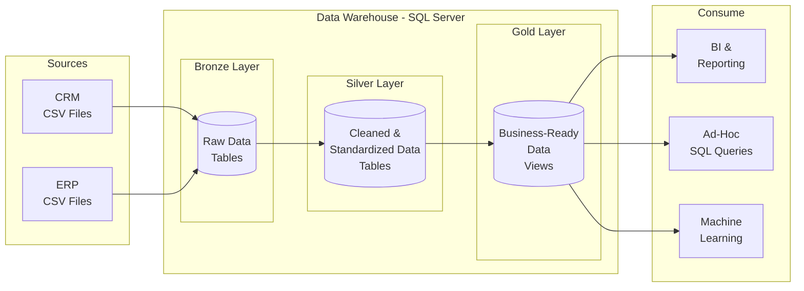

# SQL Data Warehouse

A medallion architecture data warehouse built with SQL Server, featuring Bronze, Silver, and Gold layers for progressive data cleansing and transformation.

## High Level Architecture



### Layer Details

| | Bronze Layer | Silver Layer | Gold Layer |
|--|-------------|-------------|-----------|
| **Object Type** | Tables | Tables | Views |
| **Load** | Batch Processing, Full Load, Truncate & Insert | Batch Processing, Full Load, Truncate & Insert | No Load |
| **Transformations** | None (as-is) | Data Cleansing, Standardization, Normalization, Derived Columns, Data Enrichment | Data Integrations, Aggregations, Business Logics |
| **Data Model** | None (as-is) | None (as-is) | Star Schema, Flat Table, Aggregated Table |

## Data Schema

### CRM Tables

```
┌─────────────────────────────┐
│        crm_cust_info        │
├─────────────────────────────┤
│ cst_id             INT  PK  │
│ cst_key            NVARCHAR │
│ cst_firstname      NVARCHAR │
│ cst_lastname       NVARCHAR │
│ cst_marital_status NVARCHAR │
│ cst_gndr           NVARCHAR │
│ cst_create_date    DATE     │
│ dwh_create_date    DATETIME2│
└─────────────────────────────┘

┌─────────────────────────────┐
│        crm_prd_info         │
├─────────────────────────────┤
│ prd_id          INT  PK     │
│ cat_id          NVARCHAR    │
│ prd_key         NVARCHAR    │
│ prd_nm          NVARCHAR    │
│ prd_cost        INT         │
│ prd_line        NVARCHAR    │
│ prd_start_dt    DATE        │
│ prd_end_dt      DATE        │
│ dwh_create_date DATETIME2   │
└─────────────────────────────┘

┌─────────────────────────────────┐
│       crm_sales_details         │
├─────────────────────────────────┤
│ sls_ord_num     NVARCHAR PK     │
│ sls_prd_key     NVARCHAR FK     │
│ sls_cust_id     INT  FK         │
│ sls_order_dt    DATE            │
│ sls_ship_dt     DATE            │
│ sls_due_dt      DATE            │
│ sls_sales       INT             │
│ sls_quantity    INT             │
│ sls_price       INT             │
│ dwh_create_date DATETIME2       │
└─────────────────────────────────┘

Relationships:
  crm_cust_info.cst_id    ──►  crm_sales_details.sls_cust_id
  crm_prd_info.prd_key    ──►  crm_sales_details.sls_prd_key
```

### ERP Tables

```
┌─────────────────────────────┐
│       erp_cust_az12         │
├─────────────────────────────┤
│ cid             NVARCHAR FK │
│ bdate           DATE        │
│ gen             NVARCHAR    │
│ dwh_create_date DATETIME2   │
└─────────────────────────────┘

┌─────────────────────────────┐
│        erp_loc_a101         │
├─────────────────────────────┤
│ cid             NVARCHAR FK │
│ cntry           NVARCHAR    │
│ dwh_create_date DATETIME2   │
└─────────────────────────────┘

┌─────────────────────────────┐
│      erp_px_cat_g1v2        │
├─────────────────────────────┤
│ id              NVARCHAR PK │
│ cat             NVARCHAR    │
│ subcat          NVARCHAR    │
│ maintenance     NVARCHAR    │
│ dwh_create_date DATETIME2   │
└─────────────────────────────┘

Relationships:
  crm_cust_info.cst_key  ──►  erp_cust_az12.cid
  crm_cust_info.cst_key  ──►  erp_loc_a101.cid
  crm_prd_info.cat_id    ──►  erp_px_cat_g1v2.id
```

## Project Structure

```
sql_data_warehouse/
├── data/
│   ├── source_crm/          # CRM source CSV files
│   │   ├── cust_info.csv
│   │   ├── prd_info.csv
│   │   └── sales_details.csv
│   └── source_erp/          # ERP source CSV files
│       ├── cust_az12.csv
│       ├── loc_a101.csv
│       └── px_cat_g1v2.csv
├── src/
│   ├── bronze/
│   │   ├── create_schema.sql
│   │   ├── create_ddl.sql
│   │   └── load_data.sql
│   ├── silver/
│   │   ├── silver_ddl.sql
│   │   └── silver_data_cleaning.sql
│   └── gold/
├── test/
│   └── silver_test.sql
├── LICENSE
└── README.md
```

## Quick Start

```sql
-- 1. Create schemas and bronze tables, then load
-- Run: src/bronze/create_schema.sql
-- Run: src/bronze/create_ddl.sql
EXEC bronze.load_bronze;

-- 2. Create silver tables and transform
-- Run: src/silver/silver_ddl.sql
EXEC silver.load_silver;

-- 3. Run silver data quality tests
-- Run: test/silver_test.sql
```

## Source

Data sourced from [DataWithBaraa/sql-data-warehouse-project](https://github.com/DataWithBaraa/sql-data-warehouse-project/tree/main/datasets).

## License

MIT License - see [LICENSE](LICENSE)
