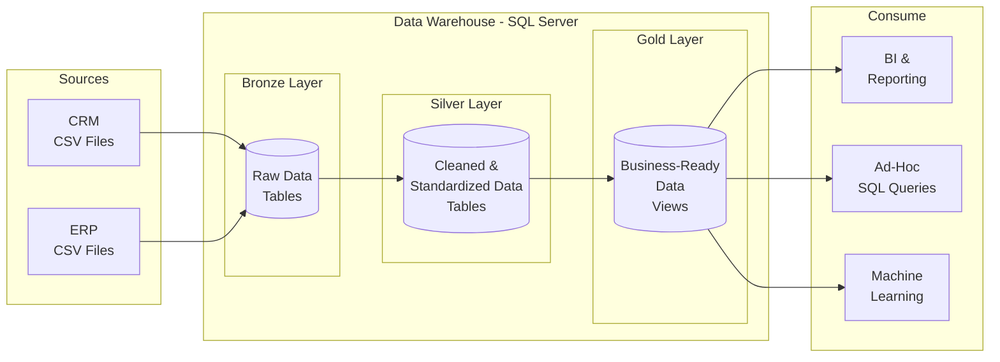

# SQL Data Warehouse

A medallion architecture data warehouse built with SQL Server, featuring Bronze, Silver, and Gold layers for progressive data cleansing and transformation.

## SQL Data Warehouse Architecture



### Layer Details

| | Bronze Layer | Silver Layer | Gold Layer |
|--|-------------|-------------|-----------|
| **Object Type** | Tables | Tables | Views |
| **Load** | Batch Processing, Full Load, Truncate & Insert | Batch Processing, Full Load, Truncate & Insert | No Load |
| **Transformations** | None (as-is) | Data Cleansing, Standardization, Normalization, Derived Columns, Data Enrichment | Data Integrations, Aggregations, Business Logics |
| **Data Model** | None (as-is) | None (as-is) | Star Schema, Flat Table, Aggregated Table |

## Data Schema

### CRM Tables

```
crm_cust_info                    crm_prd_info
┌──────────────┐                 ┌──────────────┐
│ cst_id   PK  │                 │ prd_id   PK  │
│ cst_key      │                 │ cat_id       │
│ ...          │                 │ prd_key      │
└──────┬───────┘                 │ ...          │
       │                         └──────┬───────┘
       │                                │
       ▼                                ▼
┌──────────────────────────────────────────────┐
│              crm_sales_details               │
├──────────────────────────────────────────────┤
│ sls_ord_num  PK    sls_prd_key  FK ◄─────────┤── prd_key
│ sls_cust_id  FK ◄────────────────────────────┤── cst_id
│ sls_order_dt        sls_ship_dt              │
│ sls_due_dt          sls_sales                │
│ sls_quantity        sls_price                │
└──────────────────────────────────────────────┘
```

### ERP Tables

```
crm_cust_info                    crm_prd_info
┌──────────────┐                 ┌──────────────┐
│ cst_key      │                 │ cat_id       │
└──────┬───────┘                 └──────┬───────┘
       │                                │
       ▼                                ▼
┌────────────────┐  ┌────────────────┐  ┌────────────────┐
│ erp_cust_az12  │  │ erp_loc_a101   │  │erp_px_cat_g1v2 │
├────────────────┤  ├────────────────┤  ├────────────────┤
│ cid  FK ◄──────┤  │ cid  FK ◄──────┤  │ id   PK ◄──────┤
│ bdate          │  │ cntry          │  │ cat            │
│ gen            │  └────────────────┘  │ subcat         │
└────────────────┘                      │ maintenance    │
                                        └────────────────┘
```

## Project Structure

```
sql_data_warehouse/
├── data/
│   ├── source_crm/          # CRM source CSV files
│   │   ├── cust_info.csv
│   │   ├── prd_info.csv
│   │   └── sales_details.csv
│   └── source_erp/          # ERP source CSV files
│       ├── cust_az12.csv
│       ├── loc_a101.csv
│       └── px_cat_g1v2.csv
├── src/
│   ├── bronze/
│   │   ├── create_schema.sql
│   │   ├── create_ddl.sql
│   │   └── load_data.sql
│   ├── silver/
│   │   ├── silver_ddl.sql
│   │   └── silver_data_cleaning.sql
│   └── gold/
│       └── gold_views.sql
├── test/
│   ├── silver_test.sql
│   └── gold_test.sql
├── LICENSE
└── README.md
```

## Quick Start

```sql
-- 1. Create schemas and bronze tables, then load
-- Run: src/bronze/create_schema.sql
-- Run: src/bronze/create_ddl.sql
EXEC bronze.load_bronze;

-- 2. Create silver tables and transform
-- Run: src/silver/silver_ddl.sql
EXEC silver.load_silver;

-- 3. Create gold views
-- Run: src/gold/gold_views.sql

-- 4. Run data quality tests
-- Run: test/silver_test.sql
-- Run: test/gold_test.sql
```

## Source

Data sourced from [DataWithBaraa/sql-data-warehouse-project](https://github.com/DataWithBaraa/sql-data-warehouse-project/tree/main/datasets).

## License

MIT License - see [LICENSE](LICENSE)
